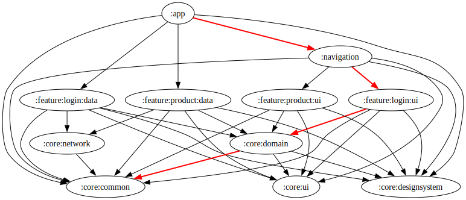

# Cashier App

## Overview
Cashier App is a modern point-of-sale system designed for retail businesses. It features an intuitive interface for managing transactions, products, and generating reports to help streamline business operations.

## Features
- **Point of Sale (POS)**: Process customer transactions quickly and efficiently
- **Product Management**: Add, edit, and track your inventory
- **Sales Reports**: Generate and view comprehensive sales analytics
- **Transaction History**: Review past transactions with detailed information

## Tech Stack
- Kotlin
- Jetpack Compose for UI
- Modular Architecture
- Material Design 3
- MVI Archirecture

## Getting Started
### Prerequisites
- Android Studio Narwhal or later
- JDK 17+
- Gradle 8.0+

### Installation
1. Clone the repository
```bash
git clone https://github.com/fajarxfce/cashier-app.git
```
## Project Structure

